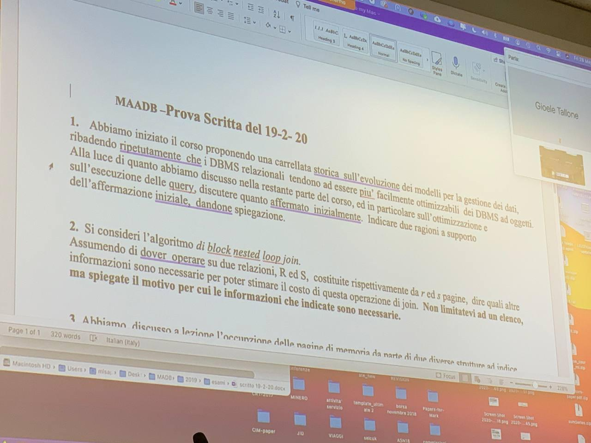

# Appunti MAADB seconda giornata

> Scritto del 18 settembre 2019

## Prima domanda

L’indice ISAM memorizza le pagine di ciascun livello dell’albero in modo
contiguo sul disco, mentre B+Tree usano liste doppiamente linkate. Quali
sono le ragioni di queste scelte? Inoltre: illustrare i vantaggi
dell’ISAM rispetto a B+Tree e il contrario.

## Prima risposta

- ISAM utilizza liste di overflow che devono essere gestite
  (staticamente solo a livello della foglia)
- In ISAM è più difficile gestire inserzione e modifica
- ISAM favorisce accessi concorrenti, il locking è meno pesante
  sull’albero
- Nel caso in cui l’overflow diventa pesante, ISAM dovrebbe
  ristrutturare tutto l’intero albero: se io devo gestire una realtà
  dinamica mi conviene utilizzare B+Tree invece che ISAM.
- Nel B+Tree potenzialmente occupiamo più memoria, non dovendo tenere i
  nodi completamente pieni ne servono di più sicuramente

## Seconda domanda

Si consideri l’algoritmo di sort merge join, si assuma di avere due
relazioni R ed S, rispettivamente di N ed M pagine. Quali altre
informazioni sarebbero necessarie per stimare il costo di questa
operazione di join?

## Seconda risposta

La formula del costo tiene conto delle seguenti informazioni: numero
pagine di buffer (posso portare più run in parallelo oppure con solo due
run posso avere tutto quello che mi serve già in memoria), la presenza
di duplicati nelle relazioni (se i duplicati sono tanti il costo del
join aumenta ed è possibile che io su certe pagine debba ciclare per
consentire il mapping valore1-valore2), se le relazioni sono già
ordinate o meno…

## Terza domanda

Si considerino due diversi algoritmi di orinamento in-memory, l’uno
veloce e l’altro lento ma con run più lunghi. Quale è migliore con un
sort esterno?

## Terza risposta

è meglio partire da uno che crea run più lunghi in quanto non dobbiamo
pensare di velocizzare un costo in memoria, ma contando sempre I/O in
quanto avere run più lunghi diminuisce letture e scritture anche se non
è veloce in memoria. Questo costo in più che ho è ripagato in quanto poi
devo fare meno fusioni in RAM successivamente e noi sappiamo che ogni
fusione è una scrittura su disco!

## Quarta domanda

Si supponga di dover odinare un file che occupa 500 pagine utilizzando
external merge sort. Avendo 6 pagine di buffer, calcolare il costo
dell’operazione di ordinamento.

## Quarta risposta

Con 6 pagine di buffer posso utilizzare la versione “a blocco”. Posso
usare 6 pagine per creare run lunghi 6, poi di queste sei pagine posso
usarne una per scaricare l’output e 5 per portarmi in memoria 5 run per
volta, ottimizzando il merge.

- Run iniziali: 500/6 = 84 cca run –&gt; costruiti con costo 2x500
  (leggo 6, ordino in memoria, riscrivo…)
- Aggiungiamo il costo delle fusioni. Fusioni: log5 84
- Costo finale: 1000 + log5 84

## Quinta domanda

“random independent” è un pattern di accesso nelle basi di dati.
Proporre un esempio di operazione di query processing che richieda
questo pattern.

## Quinta risposta

Un esempio è un join basato su indice: noi scandiamo la relazione
esterna e nell’ipotesi che sull’attributo esiste un indice, per ogni
valore della relazione esterna controlliamo che quell’attributo sia
presente. Avendo tutti *accessi indipendenti* sulla relazione interna
posso fare quindi in maniera random. Sulla relazione esterna sono dunque
sequenziali.

## Sesta domanda

Abbiamo visto che l’algoritmo Hotset per la gestione del buffer , che
analizza il comportamento ciclico delle operazioni di join e assegna a
ciascuna query un pool di buffer di dimensione pari al suo Hotset,
finisce spesso per allocare spazio di buffer eccessivo rispetto alle
effettive necessità. Illustrare le ragioni alla base di questo fenomeno.

## Sesta risposta

La dimensione dell’hotset viene stimata in modo pessimistico (sulla base
di ciò che abbiamo nel catalogo). Questa è la motivazione.

## Settima domanda

inserire domanda

## Settima risposta

Il crash non è relativo alla velocità. Ci servirebbe il log in ogni
caso, che sia veloce o meno. Quello che potrebbe eventualmente cambiare
è che potrei portare su disco delle dirty pages di relazione non ancora
committed. Se succede un crash devo comunque ripristinare la situazione
pulita in memoria. Probabilmente avrei meno transazioni da rifare in
quanto faccio più I/O, ma mi servirebbe comunque.

> Scritto del 19 febbraio 2020

## Prima domanda e Seconda domanda

## Seconda risposta

- Devo sapere chi tra R ed S è esterno oppure interno: una che guida il
  ciclo e quella su cui si cicla
- Quanto è grande il blocco?
- Cardinalità di R ed S
- Selettività degli attributi: quante copie doppie ci sono?
- Sono ordinate? Potrei ottimizzare grazie ad un pre-sorted.

## Terza domanda

L’occupazione delle pagine di memoria da parte di ISAM e B+Tree:
indicare vantaggi e svantaggi dei tassi di occupazione delle due
strutture. In caso di presenza di chiavi duplicate, cosa andrebbe
meglio?

## Terza risposta

- ISAM: tasso di occupazione del 100%, occupiamo meno memoria, leggiamo
  meno pagine a fronte di query dirette o di range, problema
  dell’overflow.
- B+Tree: tasso di occupazione dell’80%, occupa un po’ più di memoria,
  più dinamico con modifiche.
- Chiavi duplicate: se sono in una situazione statica con foglie
  ordinate va benissimo ISAM. Nella situazione dinamica B+Tree è molto
  meglio: avremmo altrimenti copie diverse in pagine diverse, anche in
  overflow.
